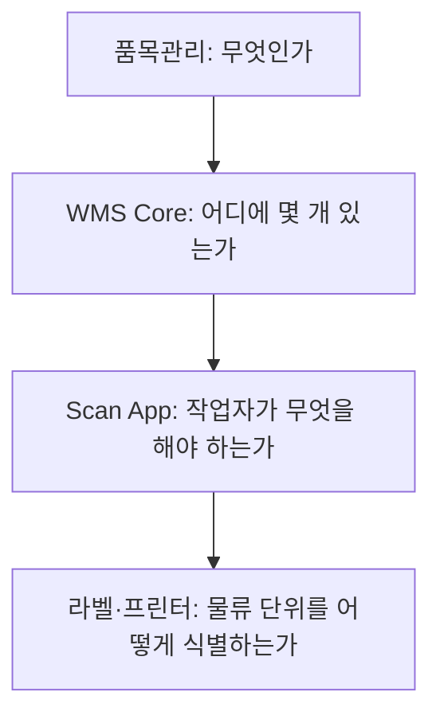
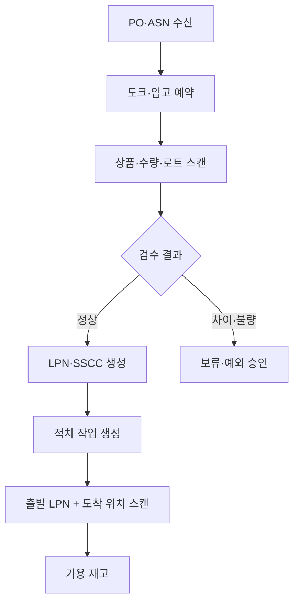
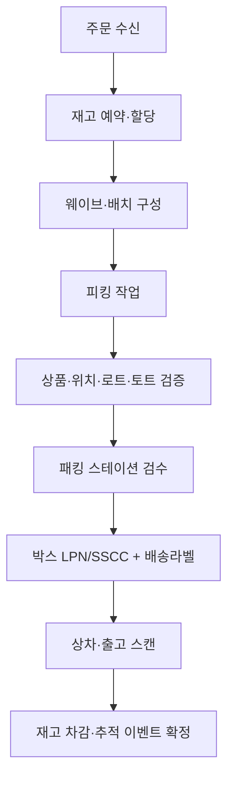

# SCM 바코드·입출고 시스템 글로벌 벤치마크 및 확장 전략

> 작성일: 2026-08-11  
> 대상: BEYOND EARTH 품목코드 관리 시스템(`index.html`) 및 BeyondPack v1.4  
> 목적: 현재의 품목·포장 도구를 향후 대형 물류창고에서도 사용할 수 있는 입출고·재고 실행 체계로 발전시키기 위한 조사와 요구사항 정의

---

## 0. 경영진 요약

### 핵심 결론

현재 두 프로그램은 유용하지만 **WMS(Warehouse Management System)는 아니다.**

- `index.html`은 품목코드, 판매채널 식별자, 패키지 구성, 원가·BOM을 관리하는 **상품 마스터·SCM 관리 시스템**이다.
- BeyondPack v1.4는 FNSKU로 상품을 조회하고 박스 정보·수량을 기록하며 박스 번호 라벨을 출력하는 **단일 포장 작업대 도구**다.
- 두 시스템 사이에 입고예정, 검수, 로트, 유통기한, 창고·로케이션, 적치, 재고이동, 할당, 피킹, 패킹 검수, 출고확정으로 이어지는 **재고 트랜잭션 원장과 작업 지시 계층**이 없다.

따라서 BeyondPack 기능을 계속 덧붙이는 방식은 권장하지 않는다. 가장 합리적인 방향은 다음과 같다.

1. 현재 품목관리 프로그램의 강점은 **Product Master 서비스**로 보존한다.
2. BeyondPack은 장기적으로 **Scan Workbench(현장 스캔 앱)**로 교체한다.
3. 그 사이에 모든 수량 변화를 기록하는 **불변 재고이동 원장(Inventory Movement Ledger)**과 입고·출고 작업 엔진을 만든다.
4. 바코드는 단순 문자열이 아니라 GTIN/FNSKU/내부 SKU/로트/일련번호/SSCC/LPN/로케이션을 구분하여 파싱한다.
5. 초기에는 간단한 화면을 유지하되, 데이터 모델과 API는 처음부터 다창고·다로케이션·다작업자·대량 동시 스캔을 수용하도록 설계한다.

### 글로벌 제품 조사에서 얻은 결론

- **가장 간단한 사용성 참고 모델:** Sortly. 사진·폴더·스마트폰 스캔 중심으로 교육비용이 낮지만, 대형 창고 실행에는 얕다.
- **소규모 창고의 빠른 도입 참고 모델:** inFlow 또는 Zoho Inventory. 주문·구매·바코드·복수 창고를 비교적 쉽게 연결한다.
- **현재 시스템을 성장형 WMS로 발전시킬 때 가장 유용한 기능 벤치마크:** Odoo Inventory + Barcode. 입고·출고·내부이동, 로케이션, 적치 규칙, 로트·일련번호, GS1, 배치·클러스터·웨이브 피킹, FEFO를 한 제품군에서 확인할 수 있다.
- **이커머스·3PL 운영 벤치마크:** ShipHero. 모바일 피킹, 다창고 주문 이행, 로트·유통기한, FIFO/FEFO, 보충과 사이클 카운트가 강점이다.
- **대형 물류센터의 설계 기준점:** Microsoft Dynamics 365 SCM, SAP EWM, Manhattan Active WM. 지금 바로 도입할 필요는 없지만 LPN/SSCC, 작업 지시, 웨이브, 노동·설비·자동화 연계, 실시간 예외 관리 수준을 목표 아키텍처에 반영해야 한다.

### 우선순위

| 우선순위 | 조치 | 이유 |
|---|---|---|
| P0 | 노출된 기본 관리자 자격증명 제거·전면 교체, 인증 강제 | 첨부 HTML의 매뉴얼에 초기 관리자 비밀번호가 평문으로 포함되어 있음 |
| P0 | 모든 재고 증감에 원인·문서·작업자·시각·출발/도착 위치를 남기는 이동 원장 구축 | 재고 신뢰성의 기초이며 사후 추적과 동시성 통제에 필수 |
| P0 | 상품·식별자·포장단위·채널·BOM을 정규화 | 현재 행 중복과 `asin/sku/fnsku` 필드의 다목적 사용은 연동 확대 시 데이터 충돌을 만든다 |
| P1 | 입고예정→검수→적치, 주문→할당→피킹→패킹→출고 상태 흐름 구현 | 현행에 없는 WMS 핵심 업무 |
| P1 | 로케이션, LPN/SSCC, 로트·유통기한, FEFO 구현 | 대형 창고·식품·화장품·건기식 운영의 필수 기반 |
| P1 | Android 러기드 스캐너용 작업 중심 UI와 프린트 큐 구현 | 키보드 입력형 데스크톱 도구로는 이동 작업과 동시 작업 확장에 한계 |
| P2 | 웨이브·배치·클러스터 피킹, 보충, 사이클 카운트 | 처리량과 재고 정확도를 높이는 성장 기능 |
| P2 | API·Webhook·Outbox/Inbox 및 Amazon/Shopify/ERP/택배 연동 | 수기 엑셀과 중복 입력 제거 |
| P3 | 노동관리, 도크·야드, WCS/AMR/컨베이어 연동 | 대형 물류센터 단계에서 필요 |

---

## 1. 조사 범위와 방법

### 1.1 검토한 첨부물

| 파일 | 검토 방식 | 확인 결과 |
|---|---|---|
| `index.html` | HTML·React 코드 정적 분석 | 4,985행, 약 320KB의 단일 프론트엔드 파일. React/Babel/Tailwind/XLSX를 NAS에서 제공하며 `/api` 백엔드를 호출 |
| `BeyondPack_v1.4 (2).z01`~`.z03`, `.zip` | 분할 ZIP을 임시 공간에서 결합한 뒤 실행파일 구조 분석 | Windows x86-64 GUI 실행파일 1개, 86,110,544 bytes |
| `BeyondPack_v1.4.exe` | PE/PyInstaller 아카이브·임베디드 모듈 정적 분석 | Python 3.13 + PySide6 + pandas 기반. `GUI_2`, `DataSearch`, `datacontrol` 모듈과 프린터·Excel·Google Sheet 연동 확인 |

재현성 확인용 BeyondPack 실행파일 SHA-256:

```text
7ca8232692c6eafbf548996f118a89d3b97f7196a68cb4e572287caeba26f072
```

### 1.2 제한사항

- 품목관리 백엔드의 `server.js`, DB 스키마, `docker-compose`, 운영 로그와 실제 데이터는 제공되지 않았다. 서버 측 제약조건, 암호 해시 방식, 세션 쿠키 옵션, TLS, API 권한 검사는 프론트엔드로 확인 가능한 범위만 평가했다.
- BeyondPack은 Windows·프린터·스캐너가 없는 분석 환경에서 실행하지 않았다. PyInstaller 패키지 구조와 임베디드 코드 객체의 함수·상수·문자열을 통해 기능을 확인했다.
- 실제 입출고량, SKU 수, 주문라인 수, 동시 작업자 수, 창고 면적과 SLA가 제공되지 않아 성능 수치는 **권장 설계 목표**로 제시한다. 최종 목표는 현장 계측 후 확정해야 한다.
- 글로벌 제품 평가는 2026-08-11 기준 공식 제품 페이지와 공식 문서를 우선 사용했다. 가격과 세부 플랜은 자주 바뀌므로 기능 적합성 위주로 평가했다.

### 1.3 평가 원칙

바코드가 있다는 사실만으로 WMS가 되지는 않는다. 본 조사는 다음 세 계층을 분리해 평가한다.

1. **마스터 데이터:** 상품, SKU, 판매채널 식별자, 포장단위, BOM, 규제정보
2. **재고 트랜잭션:** 어떤 재고가 언제 어디서 어디로, 왜, 누구에 의해 이동했는가
3. **창고 실행:** 작업을 누구에게 어떤 순서로 지시하고 스캔으로 검증하며 예외를 해결하는가

---

## 2. 바코드 프로그램과 WMS의 차이

| 구분 | 바코드 유틸리티 | 재고관리 시스템(IMS) | 창고관리 시스템(WMS) |
|---|---|---|---|
| 주목적 | 빠른 식별·입력·라벨 출력 | 보유수량과 주문·구매 관리 | 창고 안의 물리적 이동과 작업 실행 최적화 |
| 핵심 객체 | 바코드, 상품, 라벨 | SKU, 주문, 구매, 재고수량 | 창고, 로케이션, LPN/SSCC, 로트, 작업, 이동, 웨이브 |
| 입고 | 스캔 또는 수량 입력 | PO 기준 입고 가능 | 도크·ASN·검수·차이·격리·적치 작업 생성 |
| 출고 | 박스 라벨 출력 | 주문 차감 | 할당·웨이브·피킹 경로·패킹 검수·상차·출고확정 |
| 추적성 | 스캔 로그 수준 | SKU/로트 수준 가능 | 단위·로트·컨테이너의 전 이동 이력과 책임 추적 |
| 확장성 | 작업대 1~수대 | 소형~중형 사업장 | 수십~수백 작업자, 자동화 설비, 다창고 네트워크 |

Gartner의 정의에서도 WMS는 모바일 장치와 바코드/RFID를 활용해 창고 작업을 지능적으로 실행하는 **트랜잭션 기반**으로 설명된다. 즉 라벨 출력 기능이 아니라 “검증된 이동 이벤트”가 중심이다. 참고: [Gartner WMS 정의](https://www.gartner.com/reviews/market/warehouse-management-systems), [SAP의 WMS 설명](https://www.sap.com/resources/what-is-a-warehouse-management-system-wms).

---

## 3. 현행 품목코드 관리 시스템 분석

### 3.1 확인된 기능

#### 상품·채널 마스터

- 자체 품목코드 A/P 체계와 신규(+10), 리뉴얼·성분변경(+1) 세대 규칙
- Amazon, Coupang, SmartStore, Lazada, Shopee, Rakuten, Qoo10, Shopify, B2B 등 플랫폼별 식별번호 라벨 전환
- ASIN/Product ID, SKU, FNSKU/풀필먼트 라벨코드, 계정, 판매국가를 행별로 관리
- 브랜드, 한·영 상품명, Barcode(EAN/UPC), MOQ, 용량, 공급가, 소비자가, MoCRA/CPNP/SCPN 관리
- 단품, 소프트번들, 자체 브랜드 유형과 구성품/BOM 연결

#### 원가·BOM·발주 계산

- 부자재 마스터를 단일 진실원천으로 사용
- 로스율, 단가, MOQ, 발주단위, 현재고, 안전재고를 이용한 소요량·부족량·발주량 계산
- 재료비·가공비·개발비 상각을 포함한 제조원가와 초도현금 계산
- Excel 가져오기·내보내기

#### 데이터 품질·운영 안전장치

- 활성 상품의 식별번호·바코드·공급가·판매국 규제번호 누락 점검
- ASIN+SKU 조합과 FNSKU 중복 감지
- 번들 구성품 누락·구세대 참조·BOM 부자재 누락 탐지
- 409 응답을 이용한 품목·원가 동시 편집 충돌 처리
- 30초 증분 동기화와 필요 시 전체 재조회
- 소프트 삭제 후 30일 휴지통, 복구·영구 삭제
- 일일 SQLite 백업, 60일 보관, 복원 직전 안전 백업, 별도 미러 디렉터리 지원
- 활동 로그, 사용자 관리, 읽기 전용/쓰기 권한

### 3.2 강점

| 영역 | 구체적 강점 | 전문가 평가 |
|---|---|---|
| 업무 적합성 | 해외 마켓플레이스별 식별자를 한 화면에서 관리 | 범용 WMS보다 BEYOND EARTH의 실제 Amazon·글로벌 채널 운영에 더 밀착되어 있음 |
| 품목 세대 관리 | 신규와 리뉴얼을 코드 규칙으로 구분 | 바코드·성분 변경 시 과거 재고와 신재고 혼합을 막는 좋은 출발점 |
| 번들·자체브랜드 구분 | 판매 번들과 제조 BOM을 서로 다른 진실원천으로 처리 | 상업적 번들과 제조원가 BOM을 혼동하지 않도록 한 점이 좋음 |
| 무결성 리포트 | 누락·중복·오래된 구성품 참조를 사전 표시 | 단순 CRUD를 넘어 운영 사고 가능성을 업무 언어로 설명함 |
| 충돌 처리 | 최신 버전과 내 수정본을 비교하게 함 | 마지막 저장이 무조건 이기는 방식보다 안전함 |
| 복구성 | 소프트 삭제, 자동 백업, 복원 직전 백업, 미러 경고 | 소규모 사내 시스템으로서는 복구 의식이 높은 편 |
| 오프라인 프론트 의존성 제거 | 외부 CDN 대신 NAS의 vendor 파일 사용 | 인터넷 장애 시 UI가 사라지던 문제를 실무적으로 해결 |
| 사용자 경험 | 긴 매뉴얼이 화면에 내장되어 있고 용어가 현업 중심 | 신입 교육과 업무 표준화에 유리 |

### 3.3 약점과 위험

#### A. WMS 기능 부재 — 구조적 한계

다음 핵심 엔터티와 프로세스가 보이지 않는다.

- 창고, 존, 통로, 랙, 선반, 빈 로케이션
- 입고예정(PO/ASN), 실제 입고, 과부족, 파손, 검역·격리
- 로트, 제조일, 유통기한, 일련번호, 재고상태(가용/보류/불량)
- 팔레트·토트·박스를 나타내는 LPN/SSCC와 부모-자식 포장 계층
- 적치 지시, 보충, 이동, 할당, 피킹, 패킹, 상차, 출고확정
- 사이클 카운트, 블라인드 카운트, 차이 승인
- 불변 재고이동 원장과 특정 시점 재고 재구성

현재 `currentStock`은 원가·발주 계산용 부자재 숫자에 가깝고, 창고 실물재고의 이동 이력과 연결되지 않는다. 이 상태에서 입출고 기능을 화면에 직접 추가하면 “현재고 숫자 직접 수정” 방식으로 흐르기 쉬우며, 대형 창고에서 재고 불일치 원인을 추적할 수 없게 된다.

#### B. 데이터 모델의 중복과 의미 과부하

- 같은 품목코드가 채널별 여러 행으로 복제되고 공통 필드는 사용자가 선택할 때만 형제 행에 전파된다. 정규화된 `Product`와 `ChannelListing` 관계가 아니라 복제 행이므로 일관성 저하 가능성이 있다.
- Amazon 이외 플랫폼의 Product ID, Vendor Item ID, FBL/FBS/RSL 코드도 내부적으로 `asin`, `sku`, `fnsku` 필드에 저장한다. 화면은 이해하기 쉽지만 API·분석·연동 단계에서는 필드 의미가 불명확하다.
- `barcode`는 EAN/UPC라고 표시되지만 GTIN 길이, 체크 디지트, 심볼로지, 발급주체, 포장레벨을 구조화하지 않는다.
- 품목 식별, 판매채널 식별, 창고 라벨 식별이 분리되어 있지 않다. 향후 동일 상품에 GTIN-13, UPC-A, FNSKU, 내부 SKU, 케이스 GTIN, SSCC가 동시에 존재하면 충돌한다.

**개선:** `Product`, `ProductIdentifier`, `ChannelListing`, `PackagingLevel`, `BOM`을 별도 테이블로 정규화해야 한다.

#### C. 대량·동시 처리 한계

- 최초 조회는 전체 상품을 브라우저로 내려받고 필터·페이지네이션을 클라이언트에서 처리한다.
- 코드 주석 자체가 2만 행 전체 조회를 약 10MB로 언급한다. 증분 동기화는 개선이지만 초기 로드와 복잡한 검색은 계속 클라이언트 메모리에 의존한다.
- 단일 320KB HTML 안에서 JSX를 브라우저 Babel로 변환하는 구조는 배포는 단순하지만 모듈 테스트, 코드 분할, 타입 안전성, 장기 유지보수에 불리하다.
- 30초 폴링은 품목 마스터에는 충분할 수 있지만, 수 초 안에 충돌이 발생하는 피킹·재고할당에는 적합하지 않다.
- 클라이언트 생성 ID(`Date.now` + `Math.random`)는 중앙 DB의 UUID/ULID 또는 서버 발급 ID보다 통제가 약하다.

#### D. 데이터 무결성 통제가 경고 중심

- 중복이 감지되어도 “그래도 저장”이 가능하다고 매뉴얼에 명시되어 있다.
- 프론트엔드 무결성 점검은 유용하지만 DB의 `UNIQUE`, `FOREIGN KEY`, `CHECK`와 트랜잭션 제약을 대체할 수 없다.
- 원가 Excel 전체 교체는 의도적으로 버전 검사를 건너뛴다. 소규모에서는 편리하지만 동시 편집자가 많아지면 덮어쓰기 위험이 있다.
- 전체 DB 복원과 Excel 교체 권한이 일반 쓰기팀 권한과 묶여 있다. 대형 운영에서는 일상 수정과 대량 파괴성 작업 권한을 분리해야 한다.

#### E. 보안 위험

가장 시급한 문제는 첨부 HTML의 내장 매뉴얼에 **초기 관리자 계정 비밀번호가 평문으로 노출**되어 있다는 점이다. 저장소가 공개되거나 HTML이 배포되면 누구나 알 수 있다.

필수 조치:

1. 현재 운영 자격증명을 즉시 교체한다.
2. 기본 비밀번호를 코드·매뉴얼·이미지·커밋 이력에서 제거한다.
3. 최초 실행 시 일회성 관리자 생성 또는 환경변수/Secret Manager 주입 방식으로 바꾼다.
4. `REQUIRE_AUTH off`일 때 `authUser`가 없어도 쓰기를 허용하는 운영 모드를 폐지하거나 개발 환경으로 제한한다.
5. 최소 6자 비밀번호 기준을 강화하고 SSO/MFA, 로그인 감사, 비정상 접근 차단을 도입한다.
6. 세션 쿠키의 `HttpOnly`, `Secure`, `SameSite`, CSRF 방어와 TLS 종단을 서버 코드에서 확인한다.

#### F. 감사·백업의 확장 한계

- 활동 로그 최대 2만 건은 품목 마스터에는 충분할 수 있으나, 모든 스캔과 이동을 기록하는 WMS에서는 매우 짧다.
- 백업이 같은 NAS 볼륨에만 있으면 디스크·랜섬웨어·관리자 실수의 공통 장애를 피하지 못한다. 미러 기능이 있더라도 다른 장애 도메인과 불변 보관 여부를 확인해야 한다.
- 일일 백업만으로는 하루치 입출고 손실 가능성이 있다. WMS 단계에서는 시점복구(PITR)와 더 짧은 RPO가 필요하다.

### 3.4 종합 평가

| 항목 | 5점 만점 | 평가 |
|---|---:|---|
| 상품·채널 마스터 적합성 | 4.5 | 사내 업무에 매우 잘 맞음 |
| 번들·BOM·원가 | 4.0 | 경량 SCM 도구로 강함 |
| 사용 편의성 | 4.0 | 현업 용어와 내장 매뉴얼이 좋음 |
| 데이터 품질 지원 | 3.5 | 탐지 기능은 좋으나 DB 강제 여부 미확인 |
| 보안 | 1.5 | 평문 기본 자격증명 노출은 즉시 조치 필요 |
| 유지보수성 | 2.0 | 단일 HTML + 런타임 Babel 구조 |
| 대량 확장성 | 2.0 | 2만 행 고려는 되어 있으나 중앙 검색·서버 페이지네이션 부재 |
| 입출고·재고 실행 | 0.5 | WMS 핵심 기능 없음 |
| 대형 창고 적합성 | 1.0 | 마스터 모듈로는 활용 가능, 실행 시스템으로는 부족 |

---

## 4. BeyondPack v1.4 분석

### 4.1 확인된 구조

| 항목 | 내용 |
|---|---|
| 배포 | Windows x86-64 단일 EXE, PyInstaller 패키징 |
| 기술 | Python 3.13, PySide6, pandas, xlsxwriter, requests, Qt Print Support |
| 제품 조회 | 실행파일에 포함된 Google Sheet CSV export 주소에서 상품 목록 로드 |
| 데이터 | 메모리의 pandas DataFrame, Excel 불러오기·내보내기 |
| 설정 | `config.json`에 프린터명, 라벨 가로·세로, 글자 크기, 출력 ON/OFF 저장 |
| 주요 화면 | 상품 정보, 박스 정보, 박스 리스트, 프린터 설정 |

### 4.2 확인된 업무 흐름

1. 프로그램 시작 시 Google Sheet에서 상품 목록을 내려받는다.
2. 작업자가 FNSKU를 입력하거나 HID 스캐너로 입력한다.
3. FNSKU에 해당하는 상품명과 수량 정보를 표시한다.
4. 박스 수량, 무게, 가로·세로·높이를 입력한다.
5. 한 박스에 한 개 이상의 FNSKU와 수량을 추가한다.
6. 박스 데이터를 표에 기록하고 번호 라벨을 출력한다.
7. 박스 수량이 늘면 추가 라벨을 출력하고 줄면 다음 출력 번호를 되돌려 번호를 동기화한다.
8. 선택 박스 라벨 재출력, 박스 내용 수정·삭제, Excel 저장·불러오기를 지원한다.

### 4.3 강점

| 강점 | 세부 평가 |
|---|---|
| 좁고 명확한 화면 | 작업자가 FNSKU와 박스 정보에 집중할 수 있어 교육시간이 짧다 |
| 단일 EXE 배포 | Windows 작업대에 설치·실행하기 쉽다 |
| 프린터 설정과 재출력 | 프린터 선택, 라벨 크기·폰트, 출력 ON/OFF, 재출력 기능이 실무적이다 |
| 다품목 박스 | 한 박스에 여러 FNSKU와 수량을 담을 수 있다 |
| 입력 검증 | 숫자 필드, 빈 값, 최소 한 개 품목 등의 기본 오류를 차단한다 |
| Excel 호환 | 기존 작업 파일을 불러오고 결과를 다시 Excel로 전달할 수 있다 |
| 가상 프린터 회피 | PDF/XPS/OneNote 등 가상 프린터로 판단될 때 불필요한 출력을 건너뛴다 |

### 4.4 약점과 위험

#### A. 중앙 데이터와 재고 원장이 없다

- 박스 데이터의 시스템 오브 레코드는 중앙 DB가 아니라 작업대의 DataFrame/Excel이다.
- 여러 작업대가 동시에 쓰면 박스 번호, 수량, 수정·삭제가 충돌할 수 있다.
- 프로그램의 “박스 수량”은 재고이동이나 주문 이행과 연결되지 않는다.
- 입고인지 출고인지, 어떤 PO/ASN/주문/쉽먼트인지 구분하지 않는다.

#### B. Google Sheet 의존과 인증 부재

- 상품 마스터 CSV 주소가 실행파일에 하드코딩되어 있다.
- 네트워크 오류 시 “인터넷 연결을 확인”하라는 메시지를 표시할 뿐, 검증된 오프라인 캐시·버전·재시도 큐가 확인되지 않는다.
- OAuth, 서명, 응답 해시, 스키마 버전 검증이 보이지 않는다. 시트 공개 범위나 링크 유출 시 데이터 노출 가능성이 있다.
- 시트 컬럼 구조가 바뀌면 조회 실패 또는 잘못된 매핑이 발생할 수 있다.

#### C. 라벨이 물류 식별자가 아니다

정적 분석상 `print_box_label`은 중앙에 박스 번호를 그리는 형태이며, SSCC/GS1-128, 체크 디지트, 사람 판독문자, 내용물·로트·수량을 구조화한 물류 라벨이 아니다. 번호가 겹치거나 Excel 파일이 분리되면 물류 단위의 전역 유일성과 추적성을 보장하기 어렵다.

#### D. 스캔 검증이 얕다

- 입력칸에 들어온 문자열을 FNSKU와 대조하지만, 심볼로지·GS1 Application Identifier·체크 디지트·로트·유통기한·일련번호를 해석하지 않는다.
- 상품 → 위치 → 수량 → 컨테이너처럼 단계별로 요구되는 스캔 순서와 오류 복구 흐름이 없다.
- 중복 스캔, 빠른 연속 스캔, 네트워크 재시도에서 정확히 한 번만 반영되는 idempotency가 없다.

#### E. 창고 실행 기능이 없다

- 창고·로케이션·도크·스테이징·팔레트·토트 개념 없음
- 입고검수·적치·보충·피킹·패킹·상차 작업 없음
- 주문·출고차수·택배사·송장·배송라벨 연계 없음
- 로트·유통기한·FEFO·시리얼·리콜 추적 없음
- 작업자 로그인·권한·감사·생산성 측정 없음
- 사이클 카운트·차이 승인·재고상태 전환 없음

#### F. 대형 창고 운영성 부족

- Windows 데스크톱 중심이라 이동형 Android 러기드 단말의 카메라/2D imager, 진동·소리 피드백, 장갑 모드, MDM 배포에 불리하다.
- 프린트 작업이 로컬 호출에 가깝고 서버 프린트 큐, 상태·재시도·중복방지·라벨 템플릿 버전 관리가 없다.
- 모니터링, 중앙 로그, 장치 상태, 원격 설정 배포가 없다.

### 4.5 종합 평가

| 항목 | 5점 만점 | 평가 |
|---|---:|---|
| 단일 작업대 사용 편의성 | 4.0 | 좁은 목적에는 직관적 |
| FNSKU 포장 입력 | 3.5 | 기본적인 다품목 박스 기록 가능 |
| 라벨 출력 편의 | 3.0 | 설정·재출력은 좋으나 물류 표준 식별이 아님 |
| 중앙 동시 작업 | 0.5 | 중앙 트랜잭션 DB가 확인되지 않음 |
| 재고 정확성 | 0.5 | 재고 원장과 연결되지 않음 |
| 추적성 | 1.0 | 박스 Excel 이력 수준 |
| 보안·감사 | 0.5 | 사용자·권한·감사 기능이 확인되지 않음 |
| 오프라인 복원력 | 1.0 | 네트워크 실패 처리만 있고 안전한 동기화가 없음 |
| 대형 창고 적합성 | 0.5 | 구조적 재설계 필요 |

---

## 5. 두 현행 프로그램의 상호 관계

두 프로그램은 경쟁 관계가 아니라 서로 다른 계층이다.



현재는 A와 C/D의 일부만 있고 B가 비어 있다. Google Sheet가 임시 다리 역할을 하지만 거래·상태·재고의 진실원천은 아니다.

### 권장 책임 분리

| 계층 | 유지/신설 | 책임 |
|---|---|---|
| Product Master | 현 품목관리 기능을 정규화해 유지 | 제품, 채널 식별자, 포장단위, BOM, 규제정보, 바코드 정책 |
| WMS Core | 신규 | 창고·로케이션, 입출고 문서, 재고상태, 로트, LPN, 작업, 이동 원장 |
| Scan Workbench | BeyondPack 대체 | 입고·이동·피킹·패킹 등 작업별 최소 화면, 스캔 검증, 예외 처리 |
| Print Service | 신규 | 템플릿, SSCC 생성, 프린터 라우팅, 큐·재시도·감사 |
| Integration Hub | 신규 | Amazon/Shopify/ERP/택배/3PL API, Webhook, 재처리 큐 |

---

## 6. 글로벌 프로그램 심층 조사

### 평가 척도

아래 점수는 공식 기능 존재 여부와 현행 요구에 대한 **본 문서의 상대 평가**다. 벤더의 공식 등급이 아니다.

- 사용성: 초기 학습과 현장 화면의 단순성
- WMS 깊이: 입고·적치·위치·작업·피킹·패킹·추적 기능
- 확장성: 다창고·동시 사용자·자동화·복잡한 정책 수용력
- 적합도: 현재 BEYOND EARTH에서 현실적으로 참고·도입할 가치

### 6.1 전체 비교

| 제품 | 유형 | 사용성 | WMS 깊이 | 확장성 | 현재 적합도 | 한 줄 판단 |
|---|---|---:|---:|---:|---:|---|
| Sortly | 간편 재고·자산 앱 | 5.0 | 1.0 | 1.5 | 2.0 | UI 참고에는 최고, 향후 대형 창고의 코어로는 부족 |
| inFlow Inventory | SMB 재고·주문 | 4.5 | 2.5 | 2.5 | 3.5 | 빠른 도입과 바코드 업무 표준화에 좋음 |
| Zoho Inventory | SMB 옴니채널 재고 | 4.0 | 2.5 | 3.0 | 3.5 | 판매·구매·복수 창고를 쉽게 연결 |
| Odoo Inventory + Barcode | 모듈형 ERP/WMS | 3.5 | 4.0 | 4.0 | 4.5 | 기능·확장·비용 균형이 좋은 PoC 후보 |
| ShipHero | 이커머스·3PL WMS | 3.5 | 4.0 | 4.0 | 4.0 | Amazon/Shopify형 주문이행 벤치마크에 강함 |
| Dynamics 365 SCM | 엔터프라이즈 ERP/WMS | 2.5 | 4.5 | 5.0 | 3.0 | Microsoft ERP를 쓸 때 강력, 지금은 복잡·과대 가능 |
| SAP EWM | 엔터프라이즈 WMS | 2.0 | 5.0 | 5.0 | 2.5 | 대형 제조·유통센터 기준점, 도입 난이도 높음 |
| Manhattan Active WM | 클라우드 엔터프라이즈 WMS | 2.5 | 5.0 | 5.0 | 3.0 | 고처리량·노동·자동화 통합의 최종 기준점 |

### 6.2 Sortly — 가장 쉬운 UX의 기준

공식 기능:

- 스마트폰·태블릿으로 Barcode/QR 스캔
- Barcode/QR 라벨 생성·출력
- 품목 체크인/체크아웃
- 수량, 위치, 가격, SKU, 사진 관리
- 저재고 알림, 사용자 접근 제어, 오프라인 재고 기능

출처: [Sortly Barcode Inventory](https://www.sortly.com/barcode-inventory-system/), [Sortly Offline Inventory](https://www.sortly.com/features/offline-inventory-management/).

**배울 점**

- 작업자가 먼저 “무엇을 할지”를 고르고 한 번의 스캔으로 수량·위치가 바뀌는 단순한 상호작용
- 사진과 계층형 폴더/위치로 비전문가도 상품을 확인할 수 있는 시각성
- 일반 스마트폰으로 시작하고 필요할 때 외부 스캐너를 붙이는 낮은 진입장벽

**한계**

- 자산·비품·간단 재고에 적합한 앱이며 ASN, 지시형 적치, 웨이브, LPN, 패킹 검수, 자동화 설비 같은 대형 WMS 깊이는 부족하다.
- 현행 시스템의 최종 플랫폼 후보보다 **사용성 벤치마크**로 보는 것이 적절하다.

### 6.3 inFlow Inventory — 소규모 창고의 현실적 완성형

공식 기능:

- 1D/2D 바코드 생성, 라벨 디자인·대량 출력
- 스마트폰 카메라 또는 전용 Android Smart Scanner 사용
- 구매입고, 재고조정, 피킹, 패킹, 출고 과정의 스캔
- 주문·재고·저재고 알림, 로트·일련번호 등 성장 기능
- 다양한 열전사 프린터와 휴대형 라벨 프린터 지원

출처: [inFlow Barcode Software](https://www.inflowinventory.com/features/barcode-software), [inFlow Scanner 사용법](https://www.inflowinventory.com/support/cloud/how-do-i-use-a-barcode-scanner-with-inflow).

**배울 점**

- 자체 라벨 디자이너와 하드웨어를 업무 흐름에 묶어 “설정→스캔→라벨”을 쉽게 만든다.
- USB 스캐너, 휴대폰, 러기드 단말을 단계적으로 도입할 수 있다.
- BeyondPack보다 주문·구매와 재고수량을 연결한 점이 핵심 차이다.

**한계**

- 복잡한 지시형 적치, 고급 웨이브·노동관리·자동화 설비 연동은 엔터프라이즈 WMS보다 얕다.
- 향후 매우 큰 물류센터의 최종 코어라기보다 소형~중형 운영 또는 빠른 표준화 단계에 적합하다.

### 6.4 Zoho Inventory — 옴니채널·복수 창고의 쉬운 연결

공식 기능:

- Barcode/RFID 기반 재고, 바코드 생성·스캔
- 복수 창고와 창고 간 이동
- Serial 및 Batch 추적, 유통기한, 결함 배치 추적·리콜 지원
- Picklist에서 batch/serial/bin tracked item 스캔
- 포장·출고·배송 추적, 사용자 역할·권한, 판매채널·회계 연동

출처: [Zoho Inventory 기능](https://www.zoho.com/inventory/features/), [Zoho Barcode Inventory](https://www.zoho.com/inventory/barcode-software-small-businesses/), [Zoho Batch Tracking](https://www.zoho.com/inventory/help/advanced-inventory-tracking/batch-tracking.html), [Picklist Barcode 업데이트](https://www.zoho.com/inventory/whats-new/).

**배울 점**

- 판매주문·구매·창고·패키지·배송을 한 시스템 안에서 연결해 Excel 의존을 줄인다.
- 로트와 유통기한을 재고의 부가 메모가 아니라 입고·출고 선택 규칙에 연결한다.

**한계**

- 대형 센터의 정교한 작업 할당·동선 최적화·설비 오케스트레이션보다 비즈니스 재고·주문 관리에 가깝다.
- 복잡한 3PL 과금, 노동관리, 자동화가 목표이면 별도 WMS가 필요할 수 있다.

### 6.5 Odoo Inventory + Barcode — 성장형 자체 시스템의 가장 좋은 벤치마크

Odoo 공식 문서는 Inventory를 재고 앱이면서 WMS로 설명한다. Barcode 앱은 제품·포장·로트·일련번호에 바코드를 할당하고 실시간 이동을 처리한다.

공식 기능:

- 바코드로 입고, 출고, 내부이동, 재고조정
- 다창고·다로케이션, 1/2/3단계 입출고, 적치 규칙
- 로트·일련번호와 GS1 바코드 nomenclature
- FIFO/LIFO/FEFO, 최근접 위치, 최소 패키지 전략
- Batch, Cluster, Wave picking
- 패키지/포장단위, 재고조사, 제조·구매·판매 모듈 연결

출처: [Odoo Barcode](https://www.odoo.com/documentation/19.0/applications/inventory_and_mrp/barcode.html), [입고·출고 스캔](https://www.odoo.com/documentation/19.0/applications/inventory_and_mrp/barcode/operations/receipts_deliveries.html), [Putaway Rules](https://www.odoo.com/documentation/19.0/applications/inventory_and_mrp/inventory/shipping_receiving/daily_operations/putaway.html), [GS1 Nomenclature](https://www.odoo.com/documentation/19.0/applications/inventory_and_mrp/barcode/operations/gs1_nomenclature.html), [Batch Picking](https://www.odoo.com/documentation/19.0/applications/inventory_and_mrp/inventory/shipping_receiving/picking_methods/batch.html), [Cluster Picking](https://www.odoo.com/documentation/19.0/applications/inventory_and_mrp/inventory/shipping_receiving/picking_methods/cluster.html), [Wave Picking](https://www.odoo.com/documentation/19.0/applications/inventory_and_mrp/inventory/shipping_receiving/picking_methods/wave.html), [FEFO](https://www.odoo.com/documentation/19.0/applications/inventory_and_mrp/inventory/shipping_receiving/removal_strategies/fefo.html).

**배울 점**

- 현행의 Product/BOM 강점과 WMS 실행을 비교적 자연스럽게 연결할 수 있다.
- 단계별로 기능을 켤 수 있어 처음에는 입고·출고만 단순하게 운영하고 이후 로케이션·웨이브·FEFO로 발전할 수 있다.
- 오픈 모듈형 구조라 현행 A/P 코드, FNSKU, 규제정보를 확장 필드·API로 연동하기 상대적으로 쉽다.

**한계**

- 옵션이 많아 잘못 구성하면 화면은 쉬워도 데이터와 프로세스가 복잡해진다.
- 커스터마이징을 과도하게 하면 업그레이드 비용이 커진다.
- 대형 센터에서는 성능·가용성·프린트·장치·운영지원 설계를 별도로 검증해야 한다.

**판단:** 8~12주 PoC의 최우선 패키지 후보. 단, Odoo를 반드시 최종 채택하라는 뜻이 아니라 현행 요구를 빠르게 검증할 기능 기준점으로 가장 유용하다는 의미다.

### 6.6 ShipHero — 이커머스·3PL 실행의 벤치마크

공식 기능과 문서에서 확인되는 특징:

- 모바일 중심의 피킹·패킹, 자동화된 피킹 경로, 다창고 주문·재고 동기화
- 자동 라벨·바코드 스캔, 실시간 보고·분석, 판매채널 연동
- 로트·유통기한, FIFO 또는 FEFO, 만료 임박 자동 알림
- 피킹 시 로트 확인 강제, 만료 전 피킹 금지 기간
- 모바일 보충과 사이클 카운트

출처: [ShipHero WMS](https://shiphero.com/lp), [Lot/Expiration 설정](https://software-help.shiphero.com/hc/en-us/articles/4419362160653-Getting-Started-with-Lot-and-Expiration-Tracking), [Mobile Replenishment](https://software-help.shiphero.com/hc/en-us/articles/11197848661517-How-to-Use-Mobile-Replenishment-V1).

**배울 점**

- 상품 중심이 아니라 “처리할 주문과 다음 작업”을 중심으로 화면을 설계한다.
- 건강기능식품·식품·화장품에 중요한 로트/유통기한 검증을 작업자 스캔에 직접 넣는다.
- 다수의 이커머스 주문을 피킹·패킹·배송라벨까지 한 흐름으로 묶는다.

**한계**

- 이커머스/3PL에 최적화된 SaaS이므로 내부 제조원가·규제·특수 품목코드 같은 현행 고유 업무는 별도 연동이 필요하다.
- 벤더 종속, 플랜별 기능, API 한도, 커스텀 업무 적합성은 PoC에서 검증해야 한다.

### 6.7 Microsoft Dynamics 365 SCM — 작업·LPN·모바일 구성의 기준

공식 문서상 Warehouse Management mobile app은 작업자별 메뉴를 구성하고 입고가 다른 작업자의 적치 작업을 생성하도록 할 수 있다. License Plate를 스캔해 이동·이체하고, 컨테이너 패킹·마감·라벨 출력도 지원한다.

출처: [모바일 창고 작업 구성](https://learn.microsoft.com/en-us/dynamics365/supply-chain/warehousing/configure-mobile-devices-warehouse), [License Plate 이체](https://learn.microsoft.com/en-us/dynamics365/supply-chain/warehousing/create-transfer-order-from-warehouse-app), [모바일 앱 설치·대량 배포](https://learn.microsoft.com/en-us/dynamics365/supply-chain/warehousing/install-configure-warehouse-management-app).

**배울 점**

- 작업자에게 역할별로 필요한 메뉴와 단계만 보여주는 구성형 모바일 UI
- 한 작업의 완료가 다음 사람의 작업을 생성하는 Work Engine
- Location과 License Plate를 함께 스캔해 재고 위치를 검증
- 대규모 단말 배포를 MDM과 사용자 인증 관점에서 관리

**한계**

- ERP 전반과 함께 도입할 때 가치가 크며, 단순 바코드 프로그램 대체 목적으로는 비용·구축 난이도가 과도할 수 있다.

### 6.8 SAP EWM — 대형 제조·유통센터 기준

SAP EWM은 다양한 재고 이동과 창고 프로세스를 자동화하고 RF 프레임워크, Wave, Warehouse Task, Labor Management 등을 제공한다. Wave는 활동영역·경로 등의 기준으로 요청을 묶고, 해제 시 재고제거 작업을 생성한다.

출처: [SAP EWM 개요](https://help.sap.com/docs/SAP_EXTENDED_WAREHOUSE_MANAGEMENT/3d97bec9bf1649099384bb8167df3cf2/4ecb88b8b2422afee10000000a42189e.html), [RF Framework](https://help.sap.com/docs/SAP_EXTENDED_WAREHOUSE_MANAGEMENT/3d97bec9bf1649099384bb8167df3cf2/4d4fa477c9c20c7ae10000000a42189c.html), [Wave](https://help.sap.com/docs/SAP_EXTENDED_WAREHOUSE_MANAGEMENT/3d97bec9bf1649099384bb8167df3cf2/d8cbcb53ad377114e10000000a174cb4.html), [Warehouse Task 생성](https://help.sap.com/docs/PRODUCT_ID/3d97bec9bf1649099384bb8167df3cf2/7fcccb53ad377114e10000000a174cb4.html), [Labor Management](https://help.sap.com/docs/PRODUCT_ID/25cf88dfa94c49e4a440f3f1d752b8a1/a4cacb53ad377114e10000000a174cb4.html).

**배울 점**

- 문서(요청), 작업(Task), 실물 재고(Stock), 자원(Resource)을 분리하는 모델
- 웨이브를 단순 주문 묶음이 아니라 경로·활동영역·마감시간에 따른 실행 단위로 사용
- 작업 생성·확정·예외를 모두 기록해 감사 가능성을 확보

**한계**

- 구축과 운영에 전문 컨설팅이 필요하고 마스터·프로세스 통제가 성숙하지 않으면 복잡성만 증가한다.

### 6.9 Manhattan Active WM — 고처리량·자동화의 최종 기준점

Manhattan은 클라우드 네이티브 마이크로서비스와 통합 운영 데이터 모델을 기반으로 노동, 로봇, 운송을 오케스트레이션하고 실시간 가시성을 제공한다고 설명한다. 시설 전체의 인바운드·아웃바운드와 성과를 한 화면에서 관리하고 Yard/Labor/Transportation과 연결한다.

출처: [Manhattan Warehouse Management](https://www.manh.com/solutions/supply-chain-management-software/warehouse-management), [Manhattan Yard Management](https://www.manh.com/solutions/supply-chain-management-software/yard-management).

**배울 점**

- WMS가 단순 스캔 기록기가 아니라 사람·로봇·도크·운송의 우선순위를 계속 재조정하는 오케스트레이터라는 점
- 실시간 운영 상태와 분석이 같은 데이터 모델을 사용한다는 점
- 자동화 설비를 직접 로직에 하드코딩하지 않고 API와 이벤트로 연결하는 구조

**한계**

- 현재 규모에서 바로 도입하면 비용과 변화관리 부담이 클 수 있다. 향후 대형센터 RFP의 기준으로 활용하는 편이 합리적이다.

---

## 7. 기능별 상호 비교

기호: ● 기본/강함, ◐ 제한적·설정/별도 모듈 필요, ○ 확인되지 않음 또는 부재

| 기능 | 품목관리 HTML | BeyondPack | Sortly | inFlow | Zoho | Odoo | ShipHero | 엔터프라이즈 WMS |
|---|:---:|:---:|:---:|:---:|:---:|:---:|:---:|:---:|
| 상품·채널 마스터 | ● | ◐ | ◐ | ● | ● | ● | ● | ● |
| BOM·원가 | ● | ○ | ○ | ◐ | ◐ | ● | ◐ | ◐ |
| 스마트폰/러기드 스캔 | ○ | ◐ | ● | ● | ● | ● | ● | ● |
| 입고예정·검수 | ○ | ○ | ◐ | ● | ● | ● | ● | ● |
| 로케이션·Bin | ○ | ○ | ◐ | ◐ | ● | ● | ● | ● |
| 지시형 적치 | ○ | ○ | ○ | ◐ | ◐ | ● | ● | ● |
| 불변 재고이동 원장 | ○ | ○ | ◐ | ● | ● | ● | ● | ● |
| 로트·유통기한·FEFO | ○ | ○ | ◐ | ◐ | ● | ● | ● | ● |
| Serial 추적 | ○ | ○ | ◐ | ● | ● | ● | ◐ | ● |
| LPN/SSCC·팔레트 | ○ | 단순 박스번호 | ○ | ◐ | ◐ | ● | ● | ● |
| 피킹·패킹 검수 | ○ | ◐ | ○ | ● | ● | ● | ● | ● |
| Batch/Cluster/Wave | ○ | ○ | ○ | ○ | ◐ | ● | ● | ● |
| 보충 | 발주계산만 | ○ | 저재고 알림 | ◐ | ◐ | ● | ● | ● |
| 사이클 카운트 | ○ | ○ | 단순 카운트 | ● | ● | ● | ● | ● |
| 배송라벨·택배연동 | ○ | ○ | ○ | ◐ | ● | ◐ | ● | ● |
| 다중 작업자 동시성 | ◐ | ○ | ● | ● | ● | ● | ● | ● |
| 역할·권한·감사 | ◐ | ○ | ◐ | ● | ● | ● | ● | ● |
| 설비·로봇·WCS | ○ | ○ | ○ | ○ | ○ | ◐ | ◐ | ● |

### 비교에서 드러난 가장 큰 공백

1. **수량이 아니라 이동을 기록하는 원장**
2. **SKU가 아니라 재고 단위를 구분하는 로트/LPN/상태/로케이션**
3. **작업자가 무엇을 언제 할지 결정하는 Task Engine**
4. **패킹 결과를 주문·출고·배송과 묶는 Shipment/Container 모델**
5. **여러 단말과 프린터를 중앙 통제하는 장치·출력 계층**

---

## 8. 글로벌 표준 관점에서 필요한 바코드 체계

### 8.1 식별자의 역할을 분리해야 한다

| 대상 | 권장 식별자 | 비고 |
|---|---|---|
| 판매 가능한 상품·포장단위 | GTIN | 단품, 이너팩, 케이스는 서로 다른 포장레벨로 관리 |
| 사내 상품 | Internal SKU / Product Code | A/P 코드 정책 유지 가능 |
| 마켓플레이스 리스팅 | ASIN, Seller SKU, FNSKU 등 | Product와 별도 ChannelListing에 저장 |
| 로트 | Batch/Lot | GTIN과 함께 사용, 리콜·유통기한 추적 |
| 개별 일련번호 | Serial | GTIN+Serial로 개체 유일 식별 |
| 물류 단위 | SSCC 또는 내부 LPN | 팔레트·박스·토트의 이동 단위 |
| 창고 위치 | Location Barcode, 필요 시 GLN | 창고/존/통로/랙/빈 계층 |
| 문서·작업 | PO/ASN/Order/Shipment/Task ID | 실물 식별자와 분리 |

GS1 Application Identifier는 바코드 데이터의 의미와 형식을 구분한다. 대표적으로 AI (00)=SSCC, (01)=GTIN, (10)=Batch/Lot, (17)=Expiration Date, (21)=Serial이다. 출처: [GS1 AI Reference](https://ref.gs1.org/ai/).

### 8.2 SSCC 기반 물류 라벨

GS1 Logistic Label은 물류 단위를 공급망 전체에서 유일하게 식별·추적하기 위한 표준이며 핵심은 SSCC다. GS1 지원문서도 물류 라벨의 필수 식별 요소를 SSCC로 설명한다. 출처: [GS1 Logistic Label Guideline](https://www.gs1.org/standards/gs1-logistic-label-guideline/current-standard), [GS1 SSCC](https://www.gs1.org/standards/id-keys/sscc).

BeyondPack의 박스 번호는 내부 작업 편의 번호로 유지할 수 있지만 다음처럼 분리해야 한다.

- `box_no`: 사람이 보는 짧은 작업 순번
- `lpn_id`: 시스템 내부의 전역 유일 물류단위 ID
- `sscc`: 외부 파트너와 공유하는 GS1 물류단위 식별자
- `parent_lpn_id`: 팔레트 > 박스 > 토트 계층
- `label_version`, `printed_at`, `reprint_reason`: 출력 감사

### 8.3 1D와 2D를 함께 준비

- 기존 UPC/EAN/FNSKU 1D 스캔을 계속 지원한다.
- 로트·유통기한·일련번호를 한 번에 읽어야 하는 상품에는 GS1 DataMatrix 또는 GS1 Digital Link 기반 2D를 준비한다.
- GS1 DataMatrix는 상품식별, 유통기한, 배치 등 여러 데이터 요소를 한 심볼에 담을 수 있다. 출처: [GS1 DataMatrix Guideline](https://www.gs1.org/standards/gs1-datamatrix-guideline/25).
- 2D 전환 시 “스캐너가 읽었다”가 아니라 GS1 AI 파싱, FNC1, 가변길이 구분자, 체크 디지트, 허용 조합까지 검증해야 한다.

### 8.4 라벨 품질 관리

- 생성 시 GTIN/SSCC 체크 디지트를 서버에서 검증
- 라벨 템플릿별 X-dimension, 높이, Quiet Zone, 사람 판독문자(HRI) 규칙 관리
- 프린터 DPI·용지·리본·속도·농도 프로파일 관리
- 초기 도입과 정기 운영에서 ISO/IEC 기반 verifier로 등급 검사
- 잘못된 라벨은 단순 재출력하지 않고 폐기·재발행 사유와 이전 번호 관계 기록

GS1은 1D는 ISO/IEC 15416, 2D는 ISO/IEC 15415 기반 품질 검증과 체크 디지트, Quiet Zone, 대비, 크기·위치 검사를 권장한다. 출처: [GS1 Barcode Verification](https://ref.gs1.org/guidelines/barcode-verification/), [GS1 품질 체크 항목](https://support.gs1.org/support/solutions/articles/43000734141-what-should-i-check-to-ensure-good-quality-barcodes-).

### 8.5 이벤트 추적 표준

장기적으로 EPCIS의 “what, where, when, why, how” 관점을 내부 이벤트 모델에 반영하면 파트너·3PL·리콜 추적에 유리하다. 모든 이벤트를 당장 EPCIS로 외부 전송할 필요는 없지만, 데이터가 이 질문에 답하도록 설계해야 한다. 출처: [GS1 EPCIS](https://www.gs1.org/standards/epcis), [EPCIS Event Model](https://ref.gs1.org/epcis/EPCISEvent).

---

## 9. 목표 업무 프로세스

### 9.1 입고



필수 규칙:

- 예상수량과 실제수량을 별도 보관하고 차이 사유를 기록
- 동일 스캔 재전송은 idempotency key로 한 번만 반영
- 로트/유통기한 필수 상품은 값이 없으면 완료 불가
- 검수 보류·불량은 가용재고와 분리
- 입고 완료가 재고를 직접 특정 선반에 올리는 것이 아니라 적치 작업을 생성

### 9.2 출고



필수 규칙:

- 주문수신과 재고차감을 분리하고 예약/할당 상태를 둔다.
- FEFO 상품은 가장 빠른 유통기한을 기본 할당하되 예외는 권한과 사유가 필요하다.
- 패킹 시 “주문에 필요한 품목”과 “실제 박스에 넣은 품목”을 스캔 대조한다.
- 배송라벨과 SSCC/LPN을 매핑해 어떤 내용물이 어떤 송장으로 나갔는지 추적한다.
- 출고확정 전 취소와 출고 후 반품은 서로 다른 역거래로 처리한다.

### 9.3 재고조사

- 위치별 블라인드 카운트: 시스템 수량을 작업자에게 숨김
- 1차·2차 재검, 허용오차, 승인자 분리
- 차이조정은 원래 이동을 수정하지 않고 `ADJUSTMENT` 이동을 추가
- ABC 등급과 회전율에 따라 사이클 카운트 주기 자동 생성
- 조사 중 위치/품목 잠금 또는 동시 이동을 고려한 스냅샷 시각 관리

---

## 10. 필수 데이터 모델

### 10.1 핵심 엔터티

| 도메인 | 엔터티 | 핵심 필드/책임 |
|---|---|---|
| 상품 | Product | 내부 품목코드, 명칭, 브랜드, 기본 UOM, 상태 |
| 식별 | ProductIdentifier | product_id, type(GTIN/FNSKU/UPC/EAN/etc.), value, channel, packaging_level, 유효기간 |
| 채널 | ChannelListing | platform, account, marketplace, listing_id, seller_sku, fulfillment_code |
| 포장 | PackagingLevel | each/inner/case/pallet, 수량환산, 치수·중량, GTIN |
| 구성 | BOM | parent_product, component, qty, version, effective dates |
| 시설 | Warehouse/Location | 창고·존·통로·랙·선반·빈 계층, 유형, 용량, 잠금상태 |
| 추적 | Lot/Serial | 로트, 제조일, 유통기한, 공급자 로트, 품질상태 |
| 물류단위 | LPN | SSCC, 유형, 부모 LPN, 현재 위치, 상태 |
| 재고 | InventoryBalance | 조회 성능을 위한 집계값; 원장은 아님 |
| 원장 | InventoryMovement | from/to location, product, lot/serial, LPN, qty, reason, document, actor, timestamp |
| 입고 | InboundOrder/Receipt | PO/ASN, 공급자, 예상·실수량, 상태, 차이 |
| 출고 | OutboundOrder/Shipment | 주문, 우선순위, carrier, SLA, 상태 |
| 실행 | Work/Task | receive/putaway/replenish/pick/pack/load/count, assignee, priority, state |
| 출력 | LabelTemplate/PrintJob | 템플릿 버전, 데이터, 프린터, 재시도, 결과, 재출력 사유 |
| 통합 | IntegrationInbox/Outbox | 외부 event id, payload, status, retry, idempotency |
| 감사 | ScanEvent/AuditEvent | 원문 스캔, 파싱 결과, device, user, result, reason |

### 10.2 불변 원장 규칙

재고수량은 직접 덮어쓰지 않는다.

```text
현재고 = 모든 확정 InventoryMovement의 유입 합계 - 유출 합계
```

- 잘못된 이동은 삭제하지 않고 반대 이동으로 취소한다.
- 모든 이동에는 `reason_code`, `source_document`, `user_id`, `device_id`, `occurred_at`, `recorded_at`이 있어야 한다.
- 같은 외부 메시지·스캔을 재수신해도 효과가 한 번만 발생하도록 unique idempotency key를 둔다.
- `InventoryBalance`는 빠른 조회용 집계이며 원장으로 언제든 재구성 가능해야 한다.

### 10.3 상품 식별 매핑 예시

| Product | Identifier Type | Value | Scope |
|---|---|---|---|
| A000000050 | INTERNAL_SKU | A000000050 | Global |
| A000000050 | GTIN_13 | 088… | Each |
| A000000050 | FNSKU | X00… | Amazon US / Account A |
| A000000050 | SELLER_SKU | AB-CD… | Amazon US / Account A |
| A000000050 | CASE_GTIN | 188… | Case of 12 |

이 구조에서는 동일 제품의 여러 식별자를 안전하게 받아들일 수 있고, 스캔한 값이 어떤 범위에서 유일해야 하는지도 제약조건으로 표현할 수 있다.

---

## 11. 현장 UI/UX 요구사항

### 11.1 원칙

1. 화면은 데이터 테이블이 아니라 **현재 작업 한 단계**를 보여준다.
2. 가장 중요한 입력은 항상 스캔이며 키보드는 예외 처리용이다.
3. 성공은 짧은 고음·초록·진동, 실패는 저음·빨강·구체적 해결문으로 즉시 구분한다.
4. 작업자는 수량을 임의 수정하기보다 위치·상품·로트·LPN을 스캔해 시스템이 수량을 계산하게 한다.
5. 한 손·장갑·작은 화면을 고려해 버튼을 크게 하고 불필요한 메뉴를 숨긴다.
6. 오류 메시지는 “유효하지 않음”이 아니라 “주문에는 A가 필요하지만 B를 스캔함”처럼 다음 행동을 설명한다.

### 11.2 작업 화면 예

| 단계 | 화면에 보여줄 것 | 요구 스캔 | 완료 조건 |
|---|---|---|---|
| 입고 | PO, 예상 SKU·수량, 남은 수량 | 상품 → 로트/유통기한 → 수량/LPN | 예상대비 차이 해결 |
| 적치 | 출발 LPN, 추천 위치, 이동거리 | LPN → 도착 Location | 용량·혼적·상태 규칙 통과 |
| 피킹 | 다음 위치, 상품 이미지, 남은 수량 | Location → Product → Lot → Tote | 할당과 일치 |
| 패킹 | 주문, 피킹된 품목, 포장 추천 | Tote/Order → Product → Box | 주문 구성 완전 일치 |
| 출고 | Shipment, Carrier, 박스 수 | LPN/SSCC → 도크/차량 | 모든 박스 상차 확인 |

### 11.3 오프라인

오프라인은 “모든 기능을 인터넷 없이 사용”이 아니라 업무별 위험을 구분해야 한다.

- 조회·단순 카운트: 로컬 캐시 허용
- 독립적인 위치 이동: 짧은 오프라인 큐 허용 가능
- 재고 할당·피킹·출고확정: 중복 판매 위험 때문에 온라인 우선, 제한적 degraded mode만 허용
- 재연결 시 순서 보존, idempotency, 충돌 큐와 감독자 해결 화면 필수
- 단말에 저장된 데이터 암호화와 원격 삭제 필요

---

## 12. 프린터·스캐너·장치 운영 요구사항

### 12.1 스캐너

- 초기 파일럿: 기존 USB HID 2D imager를 PC/PWA에 사용
- 이동 작업: Android 러기드 모바일 컴퓨터와 손목/링 스캐너 검토
- 필수 디코드: UPC-A/E, EAN-8/13, Code 128, GS1-128, DataMatrix, GS1 DataMatrix, QR
- 스캐너 prefix/suffix에 의존하지 않고 원문 스캔과 symbology identifier를 함께 수집
- 연속 스캔 속도, 반사 포장, 작은 바코드, 손상·저대비 라벨을 실제 상품으로 테스트

### 12.2 프린터

- 데스크톱 203/300dpi와 산업용·모바일 프린터 역할을 구분
- 프린터를 작업대가 아니라 `warehouse/zone/station/purpose`로 등록
- 서버 Print Job에 템플릿 버전, 출력데이터, 프린터, 상태, 재시도 횟수, 사용자 기록
- 네트워크 장애 시 중복 출력 방지, 출력 성공 확인, reprint 사유 필수
- Zebra 등 특정 벤더 명령어는 Print Adapter 뒤에 격리해 교체 가능하게 설계

### 12.3 장치 관리

- 단말 등록·폐기, 사용자 로그인, MDM, 앱 버전 강제, 인증서·Secret 원격 교체
- 배터리·Wi-Fi·스캔 실패·프린터 오프라인을 중앙 모니터링
- 공용 단말은 작업자 교대 로그인과 빠른 잠금 지원

---

## 13. 보안·감사·복구 요구사항

### 13.1 인증·권한

- SSO(OIDC/SAML) + MFA를 기본 방향으로 설정
- 역할을 단순 팀명과 분리: Receiver, Putaway, Picker, Packer, Inventory Controller, Supervisor, Admin
- 창고·존·고객사·업무·재고상태별 권한 범위
- 대량 가져오기, 전체복원, 영구삭제, 수량조정은 일반 쓰기권한과 분리
- 중요 작업은 2인 승인 또는 재인증

### 13.2 감사

- 성공한 변경뿐 아니라 실패 스캔, 강제 우회, 권한거부, 재출력, 수동입력도 기록
- 감사로그는 수정·삭제 불가 또는 WORM/불변 저장소로 전달
- 사용자, 장치, IP, 창고, 원문·파싱값, 이전·이후값, 사유코드 포함
- 보존기간은 최소 1년을 기본 제안하되 제품·규제·계약 요구에 따라 확정

### 13.3 복구

권장 목표:

- DB: PostgreSQL 고가용성 또는 관리형 DB
- RPO ≤ 15분, RTO ≤ 4시간을 초기 목표로 설정
- PITR, 일일 전체백업, 별도 계정/리전의 불변 복제
- 3-2-1 원칙과 분기별 복원훈련
- 프린트·연동 큐도 DB와 함께 복구하여 중복 출고를 막음

---

## 14. 성능·가용성 설계 목표

실제 수요가 확정되기 전의 권장 기준:

| 항목 | 초기 목표 | 대형 창고 확장 목표 |
|---|---:|---:|
| 동시 스캔 단말 | 20 | 100~300 |
| 피크 스캔 처리 | 20 events/sec | 100~300 events/sec |
| 일 이동 이벤트 | 100,000 | 1,000,000+ |
| 온라인 스캔 응답 p95 | 500ms 이하 | 창고 LAN 기준 300ms 이하 |
| 가용성 | 99.5% | 99.9% 이상 |
| 재고 조회 | 2초 이하 | p95 1초 이하 |
| 작업 배포 지연 | 5초 이하 | 2초 이하 |

설계 포인트:

- API는 stateless, DB 트랜잭션과 unique idempotency key 사용
- 작업·이벤트 테이블은 시간/창고 기준 파티셔닝 검토
- 읽기 집계와 원장을 분리하되 원장이 진실원천
- 비동기 연동은 Outbox Pattern으로 DB 확정과 메시지 발행 불일치 방지
- WebSocket/SSE는 작업 상태 전달에 사용하되 재고 확정은 DB 트랜잭션으로 처리
- 관측성: trace id, structured log, metric, alert, dead-letter queue

---

## 15. 구현 또는 구매 전략

### 전략 A — 현행을 기반으로 핵심 WMS를 자체 구축

**적합한 경우**

- A/P 코드, 글로벌 채널, 규제·BOM 등 고유 업무가 경쟁력
- 내부 개발·운영 역량이 있고 장기적으로 제품화할 의지가 있음
- 표준 패키지에 맞추기 어려운 3PL/마켓플레이스 흐름이 많음

**장점**

- 현재 업무 적합성을 유지
- 단계별 도입 가능
- API와 데이터 소유권 확보

**위험**

- WMS 예외처리와 24/7 운영은 화면 개발보다 훨씬 어렵다.
- 테스트·보안·백업·장치·프린터·지원 체계를 계속 책임져야 한다.
- 기능을 한 번에 넓히면 장기간 미완성 시스템이 될 수 있다.

### 전략 B — Odoo/ShipHero 등 패키지 도입 + 현 품목 마스터 연동

**적합한 경우**

- 빠르게 표준 프로세스를 도입하고 내부 개발범위를 줄이고 싶음
- 다수 기능을 직접 만들기보다 업무를 표준에 맞출 수 있음

**장점**

- 입고·로케이션·피킹·로트 기능을 빠르게 검증
- 검증된 모바일·권한·워크플로 활용
- 향후 운영지원 체계 확보 가능

**위험**

- 중복 마스터와 동기화 실패 가능성
- 커스터마이징·라이선스·API 한도·벤더 종속
- 현행 A/P 코드·BOM·규제정보의 책임 경계가 모호해질 수 있음

### 전략 C — 처음부터 엔터프라이즈 WMS 도입

**적합한 경우**

- 신규 대형 센터 오픈 일정과 예산이 확정
- 자동화 설비, 다수 고객사, 복잡한 SLA, 24/7 운영이 즉시 필요
- ERP·TMS·WCS와 전사 구축을 함께 진행

**위험**

- 현재 프로세스·마스터가 정리되지 않은 상태에서 도입하면 복잡성과 비용만 증가
- 변화관리와 데이터 이관이 소프트웨어보다 더 큰 프로젝트가 됨

### 권장안: 하이브리드 단계 전략

현재는 **전략 A의 데이터 주도권 + 전략 B의 빠른 PoC** 조합이 가장 타당하다.

1. 현행 품목관리를 정규화해 Product Master로 유지한다.
2. Odoo와 ShipHero 중 1~2개로 실제 상품·주문·로트·입출고 시나리오 PoC를 수행한다.
3. 패키지의 표준 기능이 80% 이상 맞으면 연동형 도입을 우선한다.
4. 고유 기능만 별도 서비스로 유지하고 WMS 코어를 과도하게 커스터마이징하지 않는다.
5. 맞지 않는 핵심 20%가 경쟁력·법규·고객 SLA와 직결되면 자체 WMS Core를 단계 구축한다.

---

## 16. 단계별 로드맵

### Phase 0 — 보안·데이터 기준선 (0~4주)

- 노출된 관리자 자격증명 즉시 교체·코드 제거
- 운영 인증 강제, HTTPS, 쿠키·CSRF·비밀번호 저장 방식 점검
- 실제 SKU 수, 일 주문/입출고 라인, 동시 작업자, 오류율, 처리시간 계측
- 바코드·포장·채널 식별자 데이터 정리와 중복 보고서
- 현행 백업 복원 테스트, 별도 장애 도메인 백업
- BeyondPack Google Sheet 공개 범위와 데이터 민감도 점검

**완료 기준:** 운영 자격증명 노출 0, 복원훈련 성공, 식별자 중복·누락 현황 100% 파악.

### Phase 1 — 중앙 입출고 MVP (1~3개월)

- PostgreSQL 기반 WMS Core
- Product Master API와 식별자 정규화
- 창고·로케이션·재고상태·InventoryMovement
- PO/ASN 기준 입고, 수량차이, 적치
- 주문 기반 피킹·패킹·출고
- LPN과 내부 박스 라벨, 중앙 프린트 큐
- Android/PWA 스캔 앱
- 역할·감사·idempotency

**완료 기준:** 파일럿 존에서 모든 재고 증감이 원장으로 설명되고, Excel 없이 입고→출고 완료.

### Phase 2 — 정확도·처리량 (3~6개월)

- Lot/Serial/Expiration, FEFO
- Cycle Count, 차이 승인
- Replenishment, 고정/동적 피킹 로케이션
- Batch/Cluster/Wave picking
- Amazon/Shopify/택배/ERP API와 재처리 큐
- 대시보드: dock-to-stock, pick rate, order accuracy, inventory accuracy

**완료 기준:** 재고정확도 ≥ 99.8%, 오출고율 ≤ 0.1%, 모든 연동 재처리 가능.

### Phase 3 — 다창고·3PL (6~12개월)

- 다창고 재고이체, 소유자·고객사별 재고
- 3PL 입출고·보관·부가서비스 과금
- 고객 포털, ASN, EDI/API
- slotting, labor KPI, capacity planning
- 피크 부하테스트와 DR 훈련

### Phase 4 — 대형 자동화 센터 (12개월+)

- WCS/WES, AMR, conveyor, pick-to-light, scale/dimensioner 연동
- 도크·야드·상차 예약
- 실시간 작업 우선순위 최적화
- EPCIS 기반 외부 추적 이벤트 공유
- 필요 시 SAP EWM/Dynamics/Manhattan과 재평가·이관

---

## 17. PoC 시나리오와 합격 기준

벤더 데모는 기능 설명이 아니라 동일한 실제 시나리오를 수행하게 해야 한다.

### 필수 시나리오

1. 한 PO에 정상·과다·부족·파손이 섞인 입고
2. 동일 SKU의 두 로트, 서로 다른 유통기한 입고 후 FEFO 피킹
3. 한 팔레트에 여러 박스, 한 박스에 여러 SKU인 혼합 LPN
4. 동일 상품이 UPC, FNSKU, 내부 SKU로 스캔되는 식별자 매핑
5. 잘못된 위치·상품·로트 스캔과 감독자 예외 승인
6. 피킹 중 주문 취소와 이미 패킹된 주문 변경
7. 프린터 오프라인 후 재연결, 중복 없이 라벨 재시도
8. Wi-Fi 5분 단절 후 스캔 재전송과 충돌 해결
9. 두 작업자가 같은 재고를 동시에 피킹하려는 경쟁 조건
10. 특정 로트 리콜 시 입고부터 현재 위치·출고고객까지 추적
11. 블라인드 사이클 카운트와 차이 승인
12. 백업 시점복구 후 외부 주문·라벨 중복 여부 확인

### 합격 지표

| 지표 | 권장 합격선 |
|---|---:|
| 상품/위치/로트 스캔 검증 정확도 | 100% |
| 중복 스캔의 중복 재고 반영 | 0건 |
| 재고정확도 | 99.8% 이상 |
| 주문정확도 | 99.9% 이상 목표 |
| 일반 스캔 p95 응답 | 500ms 이하, 대형 단계 300ms 이하 |
| 장애 후 미처리·중복 이벤트 | 0건 |
| 특정 로트 추적 보고서 생성 | 5분 이내 |
| 신규 작업자 기본 교육 | 2시간 이내에 표준 작업 수행 |

---

## 18. KPI 체계

### 정확도

- Inventory Accuracy = 일치 로케이션-SKU-Lot 수 / 조사 대상 수
- Order Accuracy = 정확 주문 / 총 출고 주문
- Scan Override Rate = 수동 우회 스캔 / 총 스캔
- Adjustment Rate = 조정수량 / 총 이동수량

### 속도

- Dock-to-Stock Time
- Lines Received per Labor Hour
- Pick Lines per Labor Hour
- Order Cycle Time
- Pack Station Throughput

### 품질·장치

- First Scan Read Rate
- Barcode Verification Grade 실패율
- Label Reprint Rate와 사유
- Printer/Scanner Downtime
- Integration Retry/Dead-letter 건수

### 재고 건전성

- Expiring Inventory by 30/60/90 days
- FEFO Exception Rate
- Stockout/Backorder Rate
- Location Utilization
- Replenishment Emergency Rate

---

## 19. 최종 권고사항

### 유지할 것

- A/P 품목코드와 리뉴얼 세대 규칙
- 글로벌 판매채널 식별자 관리
- 번들과 자체브랜드 BOM의 구분
- 현업 친화적인 무결성 리포트와 내장 매뉴얼
- 소프트 삭제, 충돌 알림, 백업·복원 안전장치
- BeyondPack의 단순한 작업 화면, 프린터 설정, 재출력 편의

### 재설계할 것

- 동일 제품의 채널별 복제 행 → Product/ChannelListing 정규화
- `asin/sku/fnsku` 다목적 필드 → 유형화된 ProductIdentifier
- 단순 `barcode` → GTIN·포장레벨·심볼로지·유효기간 구조
- Excel/DataFrame 박스 기록 → 중앙 LPN/SSCC와 Shipment Container
- 현재고 숫자 → 불변 InventoryMovement 원장 + 집계 Balance
- 팀명 기반 권한 → 역할·업무·창고 범위 기반 RBAC
- 로컬 즉시 프린트 → 중앙 Print Job과 템플릿 버전
- 30초 품목 폴링 → 작업 이벤트의 실시간 배포와 DB 트랜잭션

### 중단할 것

- 기본 관리자 비밀번호를 소스·매뉴얼에 포함하는 방식
- 공개 또는 고정 Google Sheet CSV 주소를 실행파일에 내장하는 방식
- 중복·무결성 위반을 경고만 하고 일반 사용자가 강행하는 방식
- 재고·출고 이력의 최종 근거로 작업대 Excel을 사용하는 방식
- BeyondPack 단일 EXE에 WMS 기능을 계속 누적하는 방식

### 최종 의사결정

1. **단기:** 보안 P0를 즉시 해결하고 현행 두 프로그램은 기존 업무 범위에서만 사용한다.
2. **PoC:** Odoo Inventory + Barcode와 ShipHero를 동일 시나리오로 비교한다. 소형 창고의 아주 빠른 표준화만 필요하면 inFlow도 포함한다.
3. **구축:** Product Master는 현행 강점을 유지하되 WMS Core와 Scan App을 분리한다.
4. **확장:** 데이터 모델은 처음부터 Location, Lot, LPN/SSCC, immutable movement, Task, idempotency를 포함한다.
5. **대형 창고:** 처리량·자동화·다고객 복잡성이 실제로 도달할 때 Dynamics 365, SAP EWM, Manhattan을 RFP 기준으로 재평가한다.

가장 중요한 원칙은 **“바코드를 찍어 수량을 바꾸는 프로그램”이 아니라 “모든 물리 이동을 검증 가능한 사건으로 남기는 시스템”을 만드는 것**이다. 이 원칙을 지키면 초기 화면은 BeyondPack처럼 단순하게 유지하면서도, 데이터와 실행 구조는 대형 물류센터까지 확장할 수 있다.

---

## 20. 공식 참고자료

### 글로벌 제품

- [Sortly Barcode Inventory System](https://www.sortly.com/barcode-inventory-system/)
- [Sortly Offline Inventory](https://www.sortly.com/features/offline-inventory-management/)
- [inFlow Barcode Software](https://www.inflowinventory.com/features/barcode-software)
- [inFlow Scanner Documentation](https://www.inflowinventory.com/support/cloud/how-do-i-use-a-barcode-scanner-with-inflow)
- [Zoho Inventory Features](https://www.zoho.com/inventory/features/)
- [Zoho Batch Tracking](https://www.zoho.com/inventory/help/advanced-inventory-tracking/batch-tracking.html)
- [Odoo Barcode Documentation](https://www.odoo.com/documentation/19.0/applications/inventory_and_mrp/barcode.html)
- [Odoo Putaway Rules](https://www.odoo.com/documentation/19.0/applications/inventory_and_mrp/inventory/shipping_receiving/daily_operations/putaway.html)
- [Odoo Picking Methods](https://www.odoo.com/documentation/19.0/applications/inventory_and_mrp/inventory/shipping_receiving/picking_methods.html)
- [ShipHero WMS](https://shiphero.com/lp)
- [ShipHero Lot and Expiration Tracking](https://software-help.shiphero.com/hc/en-us/articles/4419362160653-Getting-Started-with-Lot-and-Expiration-Tracking)
- [Microsoft Dynamics 365 Warehouse Mobile Work](https://learn.microsoft.com/en-us/dynamics365/supply-chain/warehousing/configure-mobile-devices-warehouse)
- [SAP Extended Warehouse Management](https://help.sap.com/docs/SAP_EXTENDED_WAREHOUSE_MANAGEMENT/3d97bec9bf1649099384bb8167df3cf2/4ecb88b8b2422afee10000000a42189e.html)
- [Manhattan Active Warehouse Management](https://www.manh.com/solutions/supply-chain-management-software/warehouse-management)

### 표준

- [GS1 Barcodes](https://www.gs1.org/standards/barcodes)
- [GS1 Application Identifiers](https://ref.gs1.org/ai/)
- [GS1 Logistic Label Guideline](https://www.gs1.org/standards/gs1-logistic-label-guideline/current-standard)
- [GS1 SSCC](https://www.gs1.org/standards/id-keys/sscc)
- [GS1 DataMatrix Guideline](https://www.gs1.org/standards/gs1-datamatrix-guideline/25)
- [GS1 Barcode Verification Guidelines](https://ref.gs1.org/guidelines/barcode-verification/)
- [GS1 EPCIS](https://www.gs1.org/standards/epcis)

